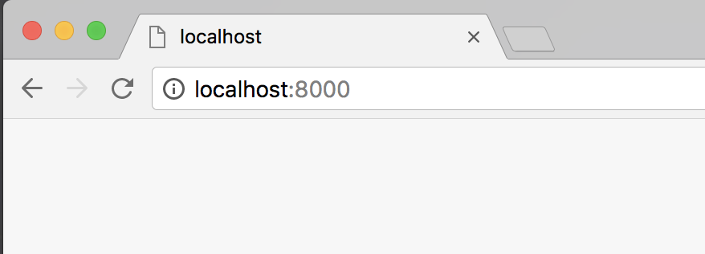

# コードの確認方法

## windowsの方

* FTPで自分のサーバにアップしてURLから確認してください。

&nbsp;
&nbsp;

---

## Macの方

#### 1.ターミナルを開く

&nbsp;

#### 2.作業フォルダをDocのターミナルにドラッグ

&nbsp;

#### 3. ローカルサーバを実行

`python -m SimpleHTTPServer`と入力してreturn

&nbsp;

#### 4. ブラウザで実行

`http://localhost:8000`　でアクセス
